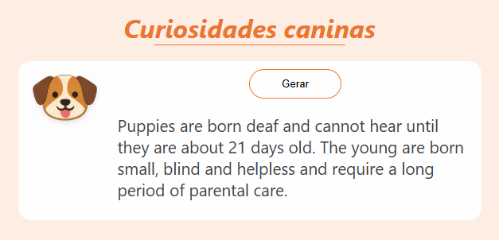

# 🐶 Curiosidades Caninas

Um projeto simples que consome uma API para mostrar curiosidades sobre cães.  
A aplicação busca um fato aleatório sobre cachorros e exibe na interface.

## 📸 Screenshot



## 🚀 Demo

Acesse a aplicação online:

🔗 **[Ver Demo](COLE_AQUI_O_LINK_DA_DEMO)**

## ⚙️ Tecnologias utilizadas

- HTML
- CSS
- JavaScript
- Fetch API

## 📡 APIs utilizadas

Este projeto utiliza as APIs:

- https://dogapi.dog/api/v1/facts

- https://api.mymemory.translated.net

## 🧠 Funcionalidades

- Buscar curiosidades aleatórias sobre cães
- Exibir o texto traduzido
- Interface simples e responsiva

## 📂 Estrutura do projeto
```
/
├── index.html
├── css/
│ └── style.css
|── images/
│ |── cachorro.PNG
│ |── imagedemo.png
| └── layout.png
├── js/
│ ├── main.js
│ ├── api.js
│ └── ui.js
└── README.md
```
## 🧩 Organização do Código

O projeto foi estruturado utilizando **modularização em JavaScript**, separando responsabilidades entre arquivos:

- `api.js` → responsável pelas requisições à API
- `ui.js` → responsável pela manipulação da interface
- `main.js` → coordena o funcionamento da aplicação

Essa separação facilita manutenção e escalabilidade do projeto.

## 🎨 Padronização de cores com CSS

As cores do projeto foram centralizadas utilizando **variáveis CSS no `:root`**, facilitando manutenção e futuras alterações de tema.

```css
:root {
  --cor-titulo: #ec7630;
  --cor-fundo: #feede2;
  --cor-fundo-card: #fefefe;
  --cor-texto: #424448;
}
```

## 📌 Melhorias futuras

- Melhorar tratamento de erros da API
- Melhorar layout

---


💡 Projeto criado para estudo de **JavaScript, consumo de API e organização de código**.
